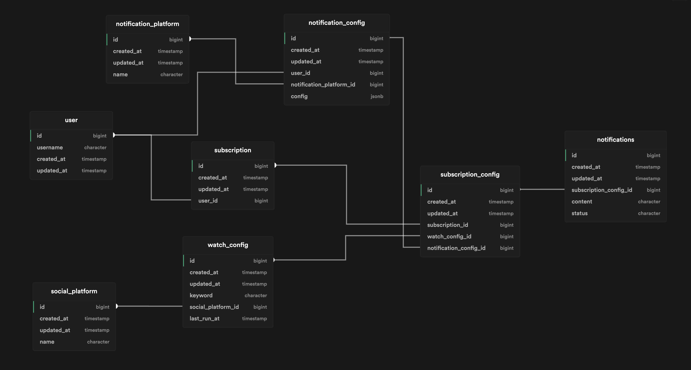

  

# Social Snitch
A Discord bot that monitors the social media for your keywords and send alerts for new mentions.

Add SocialSnitch bot to your discord server using this [invite link](https://discord.com/api/oauth2/authorize?client_id=933643318930329640&permissions=2147485696&scope=applications.commands%20bot).

  
### Features
1. Add/Remove subscriptions to specific keywords to receive alerts in a channel.
2. Supported Platforms: 
 - [HackerNews](https://news.ycombinator.com/news)
 - [Reddit](https://www.reddit.com)
 - [Twitter](https://twitter.com)

### Database Schema

  

